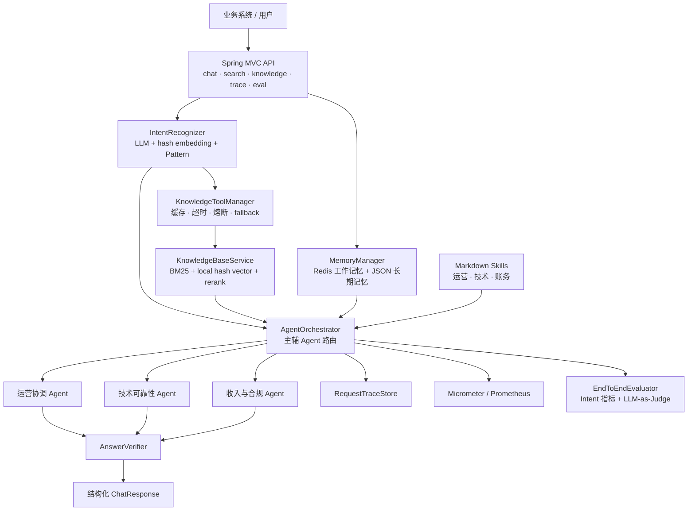

# NexusOps 架构说明

## 1. 架构目标

NexusOps 将企业运营请求组织为一条可解释、可观测、可评测的 Agent Runtime。系统围绕统一接入、结构化理解、知识与记忆增强、多角色协同和运行治理设计。

## 2. 分层架构



上图对应当前 Java 主链路；ChromaDB 仍是预留依赖，不画成已投入使用的主向量库。

```text
接入层
  EchoMindController
  /chat /search /knowledge /trace /monitor /metrics /eval

理解层
  IntentRecognizer
  细粒度意图、意图组、置信度、紧急程度、结构化实体

知识与记忆层
  MemoryManager                 KnowledgeBaseService
  Redis 工作记忆                JSON 知识持久化
  历史摘要与用户画像            BM25 + hash vector
                                查询改写与 LLM rerank

编排与执行层
  AgentOrchestrator
  primary agent + supporting agents
  GeneralAgent / TechnicalAgent / BillingAgent
  SkillManager 动态规则注入

治理层
  KnowledgeToolManager          PerformanceMonitor
  缓存、超时、熔断、fallback    成功率、延迟、路由反馈
  RequestTraceStore             EndToEndEvaluator / LLMJudge
  请求与工具轨迹                指标、评分、baseline、回归检测
```

## 3. 请求时序

```text
Client
  -> POST /chat
  -> 生成 request_id
  -> MemoryManager.loadContext
  -> IntentRecognizer.recognize
  -> 根据意图判断是否调用 KnowledgeToolManager
  -> AgentOrchestrator 计算领域分数与主辅 Agent
  -> SkillManager 匹配并注入对应规则
  -> 主、辅 Agent 生成候选回复
  -> AnswerVerifier 校验可信度与升级条件
  -> MemoryManager 写入会话并异步更新画像
  -> RequestTraceStore 记录路由和工具轨迹
  -> 返回结构化 ChatResponse
```

## 4. 关键组件

| 组件 | 职责 | 代码位置 |
|---|---|---|
| `EchoMindController` | 统一 HTTP 接入、请求编排和响应组装 | `api/EchoMindController.java` |
| `IntentRecognizer` | 意图、意图组、紧急程度和实体提取 | `intent/IntentRecognizer.java` |
| `AgentOrchestrator` | Agent 评分、主辅路由、聚合和轨迹记录 | `agent/AgentOrchestrator.java` |
| `MemoryManager` | Redis 工作记忆、长期摘要、用户画像 | `memory/MemoryManager.java` |
| `KnowledgeBaseService` | 文档切分、持久化和 Hybrid RAG | `knowledge/KnowledgeBaseService.java` |
| `KnowledgeToolManager` | 缓存、超时、熔断、降级、重排和统计 | `tool/KnowledgeToolManager.java` |
| `SkillManager` | 按 Agent 与关键词加载动态业务规则 | `skill/SkillManager.java` |
| `PerformanceMonitor` | Agent 表现、延迟、告警和路由反馈 | `monitor/PerformanceMonitor.java` |
| `EndToEndEvaluator` | 意图指标、Judge 评分和回归检测 | `evaluation/EndToEndEvaluator.java` |
| `RequestTraceStore` | 保存近期请求和工具调用轨迹 | `trace/RequestTraceStore.java` |

## 5. 数据与状态

| 状态 | 当前实现 | 生命周期 |
|---|---|---|
| 会话工作记忆 | Redis | 按配置 TTL |
| 长期摘要与用户画像 | JSON 持久化 + 内存索引 | 跨应用重启 |
| 知识库 | JSON 持久化 + 本地混合索引 | 跨应用重启 |
| 请求工具轨迹 | 进程内有界队列，最多 200 条 | 随进程结束清除 |
| 评测 baseline | JSON 文件 | 跨应用重启 |

当前 `/chat` 生成上下文仅使用当前会话的消息和摘要。跨会话摘要与画像仍存储，但不会自动注入当前业务请求；这是业务验证发现旧订单与退款意愿混入后增加的数据边界。未来若开放跨会话作答，需要显式确认事实属于哪笔订单和哪次会话。

## 6. 可靠性设计

知识检索工具具备参数校验、Top-K 限制、TTL 缓存、异步超时、熔断、确定性回退和调用统计。LLM 网关支持 Anthropic 与 DeepSeek Profile，并可在真实调用失败时返回本地降级回复。高风险或低置信度请求通过 `escalated` 标记预留人工接管接口。

## 7. 可观测与评测

在线观测覆盖 Agent 调用次数、成功率、平均延迟、熔断状态和 Prometheus 指标。按需评测覆盖 Intent Accuracy、Macro-F1、分类 Precision/Recall/F1、LLM-as-Judge 评分以及相对 baseline 的回归风险。

请求轨迹接口：

- `GET /trace/tool/{requestId}`：查询单次请求轨迹
- `GET /trace/tools?limit=20`：查询近期请求轨迹

## 8. 实现边界与演进方向

1. 将 ChromaDB 从部署预留升级为知识库和长期记忆的实际 VectorStore。
2. 将专用 `KnowledgeToolManager` 抽象为可注册企业工具的通用 Tool Registry 或 MCP 接入层。
3. 将进程内请求轨迹写入持久化可观测平台。
4. 对接真实工单、人工队列、订单、账务和身份系统。
5. 在现有意图、路由、轨迹和熔断单元测试基础上，继续补充控制器、检索与端到端回归测试。

## 9. 命名策略

NexusOps 是产品层名称，EchoMind 是历史工程代号。代码继续使用 `com.echomind`、`echomind-java` 等内部标识，以保持配置兼容和 Git 历史连续；对外文档、仓库简介和项目展示统一使用 NexusOps。
